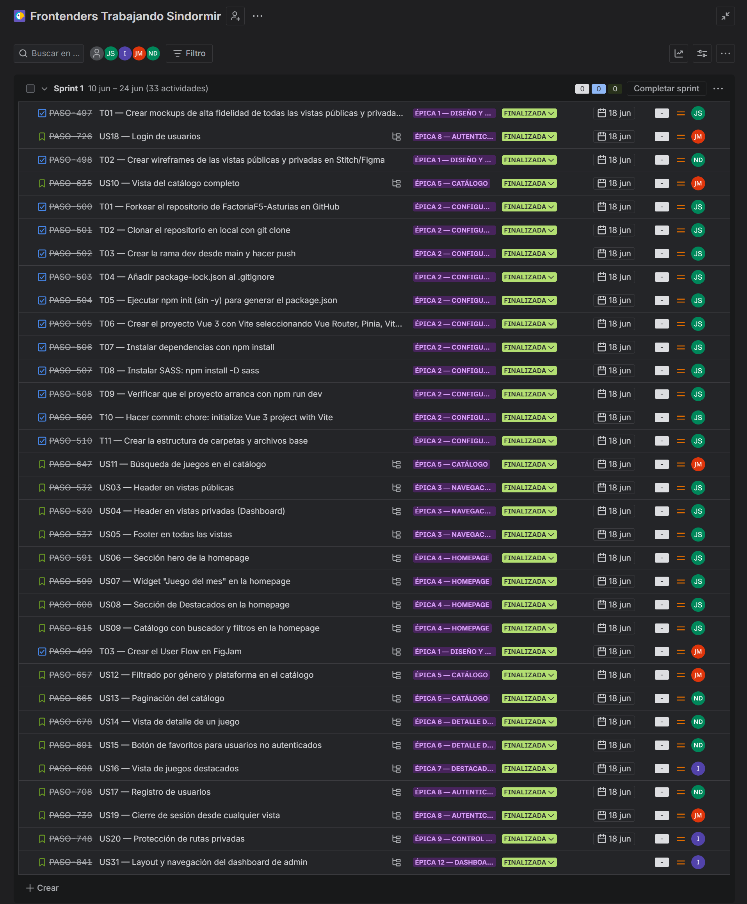
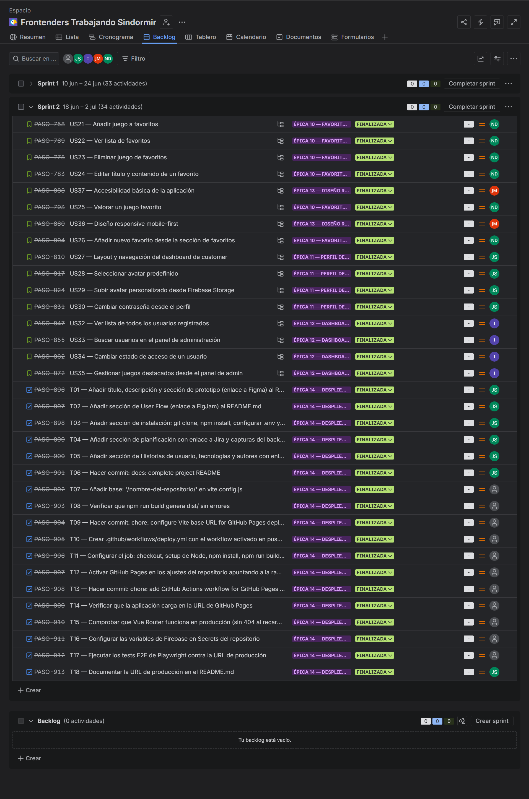
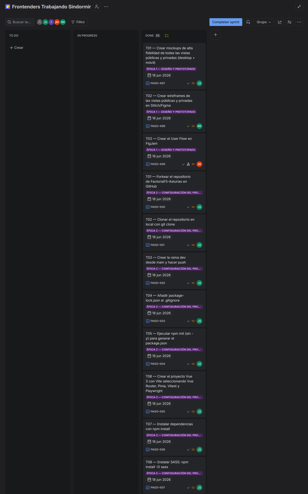
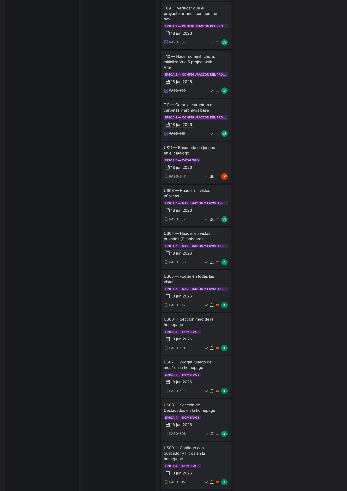
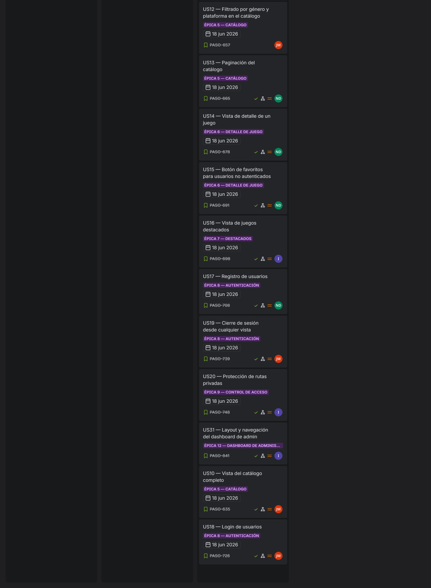
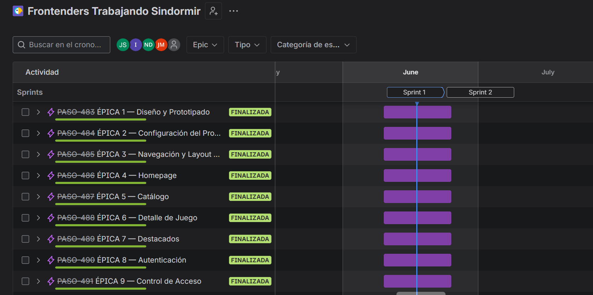
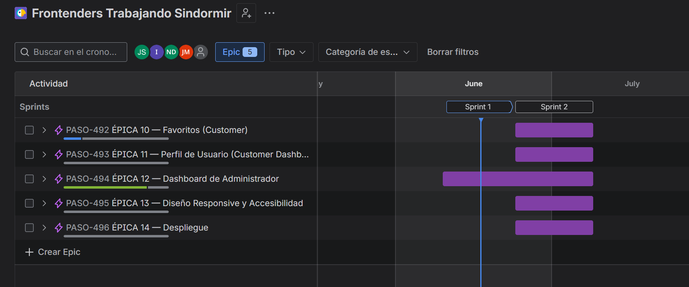
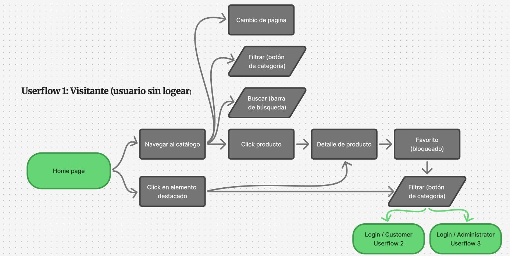
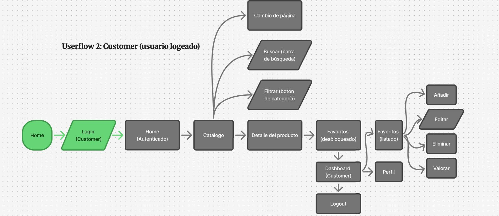
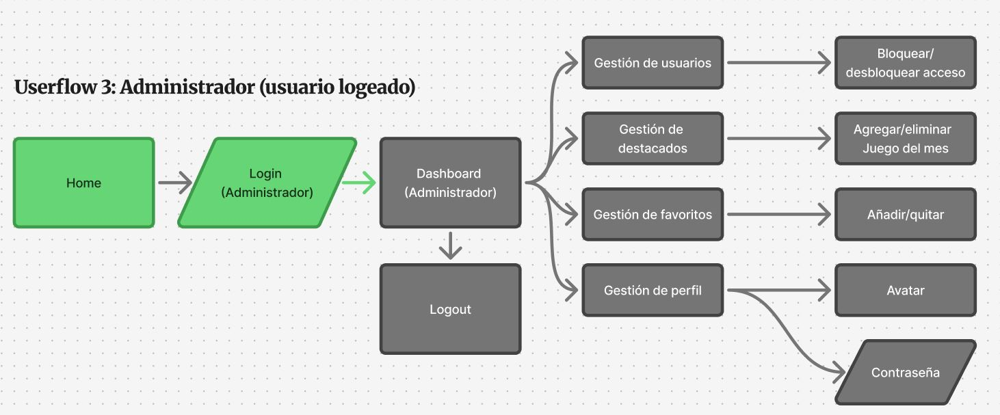

# 🎮 FPS — Frontenders Programando Sin Dormir

> _"Explora, colecciona y organiza tu universo de videojuegos favorito."_

---

## 📖 Descripción

Este proyecto forma parte de un ejercicio en equipo del bootcamp de desarrollo web en **Factoría F5**. El reto es construir una **Single Page Application (SPA)** con **Vue.js** para la gestión de una colección de videojuegos consumiendo la API de [MMOBomb](https://www.mmobomb.com/api1/games).

La aplicación permite el **registro y login de usuarios** con dos roles (`customer` y `admin`). Los usuarios `customer` pueden gestionar su lista de **favoritos** (CRUD completo + sistema de valoración por estrellas), modificar su perfil (cambiar contraseña y avatar subido a **Firebase Storage**) y acceder a un **dashboard personal**. Los administradores pueden gestionar el estado de los usuarios (permitir/restringir acceso) y configurar videojuegos destacados en la homepage.

La aplicación es **responsive**, tiene **paginación**, **filtros por género** y **búsqueda por nombre**, y está testeada con Vitest y Playwright.

Desarrollado con **Vue 3 (Composition API)**, **Vue Router**, **Pinia**, **SASS**, **Firebase** (Auth, Firestore, Storage), **TDD** con **Vitest**, **tests E2E** con **Playwright**, **GitFlow** y gestión del proyecto siguiendo metodología **Scrum** con **Jira**.

---

## 🔍 Análisis

Antes de comenzar el desarrollo analizamos los requisitos funcionales e identificamos las funcionalidades principales:

- **Autenticación y roles**: registro, login, persistencia de sesión (Pinia/localStorage) y rutas protegidas según rol
- **Homepage dinámica**: listado de videojuegos desde la API de MMOBomb con paginación, filtro por género/plataforma y búsqueda por nombre
- **Catálogo**: vista completa de juegos con buscador, filtro por género y paginación
- **Sección de destacados**: gestionada por el administrador, visible para todos los visitantes
- **Detalle de juego**: vista individual con información ampliada, plataformas y juegos similares
- **Login**: acceso de usuarios registrados con email y contraseña, validación de credenciales y redirección según rol (`customer` / `admin`)
- **Registro**: creación de cuenta nueva con email y contraseña, validación de formulario y asignación automática del rol `customer`
- **Gestión de favoritos (CRUD + Rating)**: usuarios `customer` pueden añadir/eliminar/editar/valorar juegos favoritos, e incluso crear nuevos favoritos personalizados
- **Dashboard de usuario**: perfil con cambio de contraseña y subida de avatar a Firebase Storage
- **Dashboard de admin**: listado de usuarios con posibilidad de cambiar estado (acceso permitido/restringido) y gestión de destacados
- Tests unitarios con Vitest (TDD) y tests E2E con Playwright

---

## 🚀 Instalación

```bash
# 1. Clonar el repositorio
git clone https://github.com/FactoriaF5-Asturias/project-p5-digital-academy-team1-the-univers-of-things.git

# 2. Entrar en la carpeta
cd project-p5-digital-academy-team1-the-univers-of-things

# 3. Instalar dependencias
npm install

# 4. Configurar variables de entorno
# Crea un archivo .env en la raíz con tus credenciales de Firebase:
# VITE_FIREBASE_API_KEY=...
# VITE_FIREBASE_AUTH_DOMAIN=...
# VITE_FIREBASE_PROJECT_ID=...
# VITE_FIREBASE_STORAGE_BUCKET=...
# VITE_FIREBASE_MESSAGING_SENDER_ID=...
# VITE_FIREBASE_APP_ID=...

# 5. Iniciar el servidor de desarrollo
npm run dev

# 6. Ejecutar tests unitarios
npm run test:unit

# 7. Ejecutar tests E2E
npm run test:e2e
```

---

## 🎨 Identidad visual

Antes de empezar a programar definimos la identidad visual del proyecto.

**Nombre:** **FPS** — Un acrónimo con un triple significado que conecta nuestra realidad como desarrolladores con el universo gaming:

- **Frontenders Programando Sin Dormir:** Refleja el espíritu del equipo durante el bootcamp: nocturno, comprometido y con un toque de humor.
- **First-Person Shooter (Disparos en primera persona):** Una referencia directa al género de muchos de los videojuegos que gestiona nuestra aplicación.
- **Frames Per Second:** El indicador clave de rendimiento en el desarrollo técnico y la fluidez visual de cualquier software.

**Concepto:** Interfaz oscura estilo gaming — fondo casi negro con acentos de púrpura y cian, efectos de aurora animada y tipografía técnica. Estética de producto digital moderno.

**Paleta de color:**

| Nombre                               | HEX                   |
| :----------------------------------- | :-------------------: |
| Fondo principal                      | `#030308`             |
| Surface — tarjetas y paneles         | `rgba(10,10,24,0.75)` |
| Púrpura — color principal de marca   | `#a855f7`             |
| Púrpura oscuro — hover y gradientes  | `#7c3aed`             |
| Cian — color secundario / acciones   | `#22d3ee`             |
| Naranja — acento / badges destacados | `#f97316`             |
| Texto principal                      | `#f1f5f9`             |
| Texto apagado                        | `#94a3b8`             |
| Verde — estado permitido             | `#4ade80`             |
| Rojo — estado restringido / errores  | `#ef4444`             |
| Amarillo — valoración estrellas      | `#fbbf24`             |

**Tipografías:**

- **Syne** (Display) — títulos y headings, estilo bold y técnico
- **DM Sans** (Body) — textos de cuerpo, legible y moderna
- **Space Mono** (Mono) — etiquetas, badges, navegación y código

---

## 📋 Planificación

Proyecto gestionado con **Jira** bajo metodología **Scrum** — **2 Sprints de 2 semanas** (4 semanas totales).

📸 Capturas de Jira:

| Backlog Sprint 1 | Backlog Sprint 2 |
| :------------------: | :------------------: |
|  |  |

| Tablero (1/3) | Tablero (2/3) | Tablero (3/3) |
| :---------------: | :---------------: | :---------------: |
|  |  |  |

| Cronograma Sprint 1 | Cronograma Sprint 2 |
| :---------------------: | :---------------------: |
|  |  |

---

## 🗺️ Userflow

Diseñado en FigJam antes del desarrollo para mapear las rutas de usuario, administrador y visitante.

🔗 [Ver userflow en FigJam](https://www.figma.com/board/MHzYugh6tsOUmmw6wrvBHw/FPS---User-Flow)

| Ruta | Tipo de usuario | Captura |
| :--- | :------ | :------: |
| Visitante | Usuario no autenticado |  |
| Customer | Usuario registrado |  |
| Admin | Administrador |  |

**Ruta visitante:**
Home → Catálogo (filtro/búsqueda/paginación) → Detalle de juego → (botón de favorito bloqueado) → Login/Register

**Ruta principal (customer):**
Home → Login → Catálogo → Detalle → Añadir a favoritos → Dashboard de usuario → Gestionar favoritos (CRUD + rating) → Perfil (cambiar avatar/contraseña) → Logout

**Ruta principal (admin):**
Home → Login (admin) → Admin Dashboard → Gestionar usuarios (permitir/restringir) → Gestionar
destacados → Logout

---

## 🎨 Prototipo y diseño

### Wireframes

🔗 Ver en Figma → _en proceso_

### Prototipo

El prototipo completo de la aplicación está desarrollado para **todas las vistas**: Homepage, Catálogo, Destacados, Detalle de juego, Login, Register, Dashboard de usuario y Dashboard de admin.

| Vista | Descripción | Captura |
| :----- | :---------- | :------: |
| **Homepage** | Hero con "Juego del mes", sección bento de destacados y catálogo (2 filas × 5 columnas) | _en proceso_ |
| **Catálogo** | 20 juegos en grid de 5 columnas con búsqueda y filtros | _en proceso_ |
| **Destacados** | Card hero principal + grid de 9 destacados | _en proceso_ |
| **Detalle de juego** | Banner, descripción, stats (jugadores, valoración), capturas y juegos similares | _en proceso_ |
| **Login** | Formulario de acceso + botón de demo admin | _en proceso_ |
| **Register** | Formulario de registro | _en proceso_ |
| **Dashboard de usuario** | Perfil (avatar picker + Firebase + cambio de contraseña) + Mis Favoritos (CRUD + rating) | _en proceso_ |
| **Dashboard de admin** | Gestión de usuarios + Favoritos globales + Perfil + Destacados y Juego del mes | _en proceso_ |

---

## 👤 Historias de usuario y criterios de aceptación

---

### HU-01 — Header en vistas públicas

- **Como** usuario visitante
- **Quiero** ver un header con el logo de FPS, menú de navegación y botones de Iniciar Sesión / Registrarse
- **Para** orientarme y navegar fácilmente por cualquier sección pública

<details>
<summary>Criterios de aceptación</summary>

- **Escenario 1: Header visible para visitantes**
  - **Dado** que soy un usuario visitante en cualquier vista pública
  - **Cuando** cargo la página
  - **Entonces** veo el header con el logo, los enlaces de navegación y los botones de Iniciar Sesión y Registrarse
- **Escenario 2: Navegación SPA sin recarga**
  - **Dado** que estoy en el header
  - **Cuando** hago clic en cualquier enlace del menú
  - **Entonces** soy redirigido a la vista correspondiente sin recargar la página
- **Escenario 3: Header con sesión iniciada**
  - **Dado** que soy un usuario autenticado en cualquier vista
  - **Cuando** visualizo el header
  - **Entonces** los botones de Iniciar Sesión y Registrarse son reemplazados por mi nombre de usuario y el botón de Cerrar Sesión

</details>

---

### HU-02 — Header en vistas privadas / Dashboard

- **Como** usuario autenticado
- **Quiero** ver en el dashboard un header con el logo, la ruta actual y mi nombre y rol
- **Para** saber en todo momento que estoy en mi área privada

<details>
<summary>Criterios de aceptación</summary>

- **Escenario 1: Header de customer**
  - **Dado** que soy un usuario customer autenticado en el dashboard
  - **Cuando** cargo cualquier vista privada
  - **Entonces** veo el header con el logo, el texto "/ Dashboard", mi nombre y el badge "CLIENTE"
- **Escenario 2: Header de admin**
  - **Dado** que soy un usuario admin autenticado en el dashboard
  - **Cuando** cargo cualquier vista privada
  - **Entonces** veo el header con el texto "/ Dashboard Admin" y el badge "ADMIN"

</details>

---

### HU-03 — Footer en todas las vistas

- **Como** usuario visitante o autenticado
- **Quiero** ver un footer con el copyright y los enlaces a redes sociales
- **Para** tener acceso a la información legal y a las redes de FPS desde cualquier página

<details>
<summary>Criterios de aceptación</summary>

- **Escenario 1: Footer visible**
  - **Dado** que soy un usuario en cualquier vista
  - **Cuando** cargo la página
  - **Entonces** veo el footer con el copyright "© 2026 FPS" y los iconos de redes sociales
- **Escenario 2: Redes sociales en pestaña nueva**
  - **Dado** que visualizo el footer
  - **Cuando** hago clic en un icono de red social
  - **Entonces** el enlace se abre en una pestaña nueva

</details>

---

### HU-04 — Sección hero de la homepage

- **Como** usuario visitante
- **Quiero** ver una sección hero con la identidad de FPS y botones de acceso rápido al Catálogo y Destacados
- **Para** entender de qué trata la plataforma y acceder a las secciones principales

<details>
<summary>Criterios de aceptación</summary>

- **Escenario 1: Hero visible al cargar**
  - **Dado** que estoy en la homepage
  - **Cuando** la página termina de cargar
  - **Entonces** veo el logo grande de FPS, el acrónimo, el slogan y los botones "Ver Catálogo" y "Ver Destacados"
- **Escenario 2: Navegación al catálogo**
  - **Dado** que estoy en la sección hero
  - **Cuando** hago clic en "Ver Catálogo"
  - **Entonces** soy redirigido a la vista del catálogo
- **Escenario 3: Navegación a destacados**
  - **Dado** que estoy en la sección hero
  - **Cuando** hago clic en "Ver Destacados"
  - **Entonces** soy redirigido a la vista de destacados

</details>

---

### HU-05 — Widget "Juego del mes" en la homepage

- **Como** usuario visitante
- **Quiero** ver el widget del "Juego del mes" con imagen, título y descripción
- **Para** descubrir el juego más destacado de la plataforma

<details>
<summary>Criterios de aceptación</summary>

- **Escenario 1: Widget visible**
  - **Dado** que el admin ha configurado un juego del mes
  - **Cuando** cargo la homepage
  - **Entonces** veo el widget con el badge "Juego del mes", título, descripción y tags
- **Escenario 2: Navegación al detalle**
  - **Dado** que visualizo el widget del juego del mes
  - **Cuando** hago clic sobre él
  - **Entonces** soy redirigido a la página de detalle de ese juego

</details>

---

### HU-06 — Sección de Destacados en la homepage

- **Como** usuario visitante
- **Quiero** ver una sección de juegos destacados en la homepage
- **Para** descubrir los mejores títulos sin ir al catálogo completo

<details>
<summary>Criterios de aceptación</summary>

- **Escenario 1: Sección destacados visible**
  - **Dado** que estoy en la homepage
  - **Cuando** cargo la página
  - **Entonces** veo la sección "Destacados" con los juegos marcados por el admin en formato bento grid
- **Escenario 2: Navegación al detalle**
  - **Dado** que estoy en la sección de destacados
  - **Cuando** hago clic en una tarjeta
  - **Entonces** soy redirigido a la página de detalle de ese juego

</details>

---

### HU-07 — Catálogo con buscador y filtros en la homepage

- **Como** usuario visitante
- **Quiero** ver en la homepage un buscador, filtros por Género y Plataforma y una grid de juegos con paginación
- **Para** explorar y encontrar juegos directamente desde la página de inicio

<details>
<summary>Criterios de aceptación</summary>

- **Escenario 1: Búsqueda en tiempo real**
  - **Dado** que estoy en la homepage
  - **Cuando** escribo texto en el buscador
  - **Entonces** la grid se actualiza en tiempo real mostrando solo los juegos cuyo título coincide
- **Escenario 2: Filtro por género**
  - **Dado** que uso los filtros de la homepage
  - **Cuando** selecciono un género o plataforma
  - **Entonces** la grid muestra únicamente los juegos que cumplen esa condición
- **Escenario 3: Paginación funcional**
  - **Dado** que visualizo la grid de juegos
  - **Cuando** hago clic en los controles de paginación
  - **Entonces** veo la página siguiente o anterior sin recargar la aplicación

</details>

---

### HU-08 — Detalle de un juego

- **Como** visitante
- **Quiero** ver la página de detalle de un juego
- **Para** obtener información completa antes de añadirlo a favoritos

<details>
<summary>Criterios de aceptación</summary>

- **Escenario 1: Ver detalle**
  - **Dado** que estoy en el catálogo o en destacados
  - **Cuando** hago clic en una tarjeta de juego
  - **Entonces** navego a la vista de detalle con banner, título, género, descripción larga, plataformas, capturas y juegos similares
- **Escenario 2: Botón de favorito bloqueado para visitantes**
  - **Dado** que no estoy logueado
  - **Cuando** veo el panel lateral del detalle
  - **Entonces** el botón "Añadir a favoritos" aparece bloqueado con el texto "Inicia sesión para guardar"
- **Escenario 3: Navegación con breadcrumb**
  - **Dado** que estoy en la vista de detalle
  - **Cuando** hago clic en "Catálogo" en el breadcrumb
  - **Entonces** vuelvo al catálogo

</details>

---

### HU-09 — Registro de nuevos usuarios

- **Como** usuario nuevo
- **Quiero** registrarme con email y contraseña
- **Para** crear mi cuenta y acceder a la funcionalidad de favoritos

<details>
<summary>Criterios de aceptación</summary>

- **Escenario 1: Registro exitoso**
  - **Dado** que estoy en `/register`
  - **Cuando** introduzco un email válido, una contraseña de al menos 6 caracteres, confirmo la contraseña y envío el formulario
  - **Entonces** se crea mi cuenta en Firebase Auth con rol `customer` y soy redirigido a la homepage logueado
- **Escenario 2: Email ya registrado**
  - **Dado** que intento registrarme con un email ya existente
  - **Cuando** envío el formulario
  - **Entonces** veo un mensaje de error "El email ya está registrado"
- **Escenario 3: Enlace a login**
  - **Dado** que estoy en el formulario de registro
  - **Cuando** hago clic en "Inicia sesión"
  - **Entonces** navego a `/login`

</details>

---

### HU-10 — Login de usuarios

- **Como** usuario registrado
- **Quiero** iniciar sesión con mis credenciales
- **Para** acceder a mis favoritos y dashboard

<details>
<summary>Criterios de aceptación</summary>

- **Escenario 1: Login exitoso como customer**
  - **Dado** que estoy en `/login`
  - **Cuando** introduzco email y contraseña correctos de un usuario `customer`
  - **Entonces** accedo a la homepage y el header muestra mi nombre de usuario
- **Escenario 2: Login exitoso como admin**
  - **Dado** que estoy en `/login`
  - **Cuando** introduzco las credenciales de un usuario `admin`
  - **Entonces** soy redirigido al Admin Dashboard
- **Escenario 3: Credenciales incorrectas**
  - **Dado** que introduzco credenciales incorrectas
  - **Cuando** envío el formulario
  - **Entonces** veo un mensaje de error "Email o contraseña inválidos"

</details>

---

### HU-11 — Persistencia de sesión

- **Como** sistema
- **Quiero** persistir la sesión del usuario
- **Para** que no tenga que loguearse en cada visita

<details>
<summary>Criterios de aceptación</summary>

- **Escenario 1: Sesión activa al recargar**
  - **Dado** que un usuario ha iniciado sesión y recarga o cierra el navegador
  - **Cuando** vuelve a abrir la aplicación
  - **Entonces** sigue autenticado y puede acceder directamente a rutas protegidas

</details>

---

### HU-12 — Añadir juego a favoritos desde el detalle

- **Como** usuario customer logueado
- **Quiero** añadir un juego a mis favoritos desde su página de detalle
- **Para** guardarlo y gestionarlo después

<details>
<summary>Criterios de aceptación</summary>

- **Escenario 1: Añadir favorito**
  - **Dado** que estoy en la vista de detalle de un juego y estoy logueado como customer
  - **Cuando** hago clic en el botón "Añadir a favoritos"
  - **Entonces** el juego se guarda en Firestore y aparece un mensaje de confirmación
- **Escenario 2: No duplicar favoritos**
  - **Dado** que ya tengo ese juego en favoritos
  - **Cuando** vuelvo a su página de detalle
  - **Entonces** el botón muestra "Ya en favoritos" y no permite añadirlo de nuevo

  > 📝 **En proceso para sprint 2:** además de añadir a favoritos desde el detalle del juego, se extenderá esta función directamente a las tarjetas de la homepage y el catálogo, tal como se especifica en los requisitos funcionales del proyecto.

</details>

---

### HU-13 — Ver y gestionar mis favoritos

- **Como** usuario customer
- **Quiero** acceder a mi sección "Mis Favoritos" en el dashboard
- **Para** ver todos mis juegos guardados con su valoración y notas

<details>
<summary>Criterios de aceptación</summary>

- **Escenario 1: Acceso correcto**
  - **Dado** que soy un customer logueado
  - **Cuando** accedo a la sección "Mis Favoritos" del dashboard
  - **Entonces** veo el contador de juegos guardados y la cuadrícula con todas mis tarjetas de favoritos
- **Escenario 2: Acceso denegado sin login**
  - **Dado** que intento acceder al dashboard sin estar logueado
  - **Entonces** soy redirigido a `/login`

</details>

---

### HU-14 — Eliminar, editar y valorar un favorito

- **Como** usuario customer
- **Quiero** eliminar, editar las notas y valorar con estrellas mis favoritos
- **Para** mantener mi lista organizada y recordar cuáles me han gustado más

<details>
<summary>Criterios de aceptación</summary>

- **Escenario 1: Eliminar favorito**
  - **Dado** que estoy en "Mis Favoritos"
  - **Cuando** hago clic en "Eliminar" de una tarjeta y confirmo
  - **Entonces** la tarjeta desaparece y se elimina de Firestore
- **Escenario 2: Editar notas**
  - **Dado** que estoy en "Mis Favoritos"
  - **Cuando** hago clic en "Editar" y modifico el texto
  - **Entonces** los cambios se guardan en Firestore y se reflejan en la tarjeta
- **Escenario 3: Valorar con estrellas**
  - **Dado** que veo una tarjeta de favorito
  - **Cuando** hago clic en la tercera estrella
  - **Entonces** las tres primeras estrellas se iluminan en amarillo y la valoración persiste al recargar

</details>

---

### HU-15 — Añadir nuevo juego personalizado a favoritos

- **Como** usuario customer
- **Quiero** crear un nuevo favorito personalizado desde cero
- **Para** añadir juegos que no están en la API

<details>
<summary>Criterios de aceptación</summary>

- **Escenario 1: Crear favorito personalizado**
  - **Dado** que estoy en "Mis Favoritos"
  - **Cuando** hago clic en "+ Añadir nuevo juego" y completo título, género y notas
  - **Entonces** el nuevo favorito aparece en mi cuadrícula y se almacena en Firestore con `isCustom: true`

</details>

---

### HU-16 — Perfil de usuario: cambiar avatar y contraseña

- **Como** usuario customer
- **Quiero** gestionar mi perfil: cambiar mi avatar y mi contraseña
- **Para** personalizar mi cuenta

<details>
<summary>Criterios de aceptación</summary>

- **Escenario 1: Elegir avatar del picker**
  - **Dado** que estoy en la sección "Perfil" de mi dashboard
  - **Cuando** hago clic en uno de los avatares del picker
  - **Entonces** el avatar se actualiza visualmente en el perfil y en el sidebar
- **Escenario 2: Subir avatar a Firebase Storage**
  - **Dado** que estoy en la sección "Perfil"
  - **Cuando** selecciono una imagen (JPG/PNG)
  - **Entonces** la imagen se sube a Firebase Storage, la URL se guarda en Firestore y el avatar se actualiza
- **Escenario 3: Cambiar contraseña**
  - **Dado** que estoy en la sección "Perfil"
  - **Cuando** introduzco la contraseña actual, la nueva y la confirmación
  - **Entonces** la contraseña se actualiza en Firebase Auth y recibo un mensaje de éxito

</details>

---

### HU-17 — Dashboard admin: gestión de usuarios

- **Como** usuario admin
- **Quiero** ver y gestionar todos los usuarios registrados
- **Para** controlar el acceso a la plataforma

<details>
<summary>Criterios de aceptación</summary>

- **Escenario 1: Ver tabla de usuarios**
  - **Dado** que soy admin y estoy en "Gestión de usuarios"
  - **Cuando** cargo la sección
  - **Entonces** veo una tabla con avatar, nombre, correo, estado y botón de acción por usuario
- **Escenario 2: Cambiar estado de un usuario**
  - **Dado** que un usuario tiene estado "Permitido"
  - **Cuando** hago clic en "Restringir"
  - **Entonces** el badge cambia a "Restringido" y ese usuario no puede iniciar sesión
- **Escenario 3: Acceso denegado a customer**
  - **Dado** que un usuario con rol `customer` intenta acceder a `/admin`
  - **Entonces** es redirigido a `/dashboard`

</details>

---

### HU-18 — Dashboard admin: favoritos y destacados

- **Como** usuario admin
- **Quiero** ver los favoritos de todos los usuarios y gestionar los destacados y el juego del mes
- **Para** tener visibilidad del contenido guardado y curar lo que ven los visitantes en la homepage

<details>
<summary>Criterios de aceptación</summary>

- **Escenario 1: Ver tabla de favoritos**
  - **Dado** que soy admin y accedo a la sección "Favoritos"
  - **Cuando** cargo la sección
  - **Entonces** veo una tabla con usuario, juego, género, valoración, fecha y botón de eliminar
- **Escenario 2: Seleccionar juego del mes**
  - **Dado** que estoy en "Destacados"
  - **Cuando** marco un juego como "Juego del mes"
  - **Entonces** ese juego aparece como destacado principal en el hero de la homepage
- **Escenario 3: Gestionar juegos activos**
  - **Dado** que estoy en la sección de destacados
  - **Cuando** activo o desactivo juegos
  - **Entonces** los cambios se guardan en Firestore y la sección "Destacados" se actualiza

</details>

---

### HU-19 — Dashboard admin: perfil propio

- **Como** usuario admin
- **Quiero** poder cambiar mi avatar y contraseña desde mi perfil
- **Para** gestionar mis datos de administrador

<details>
<summary>Criterios de aceptación</summary>

- **Escenario 1: Cambiar avatar**
  - **Dado** que soy admin y estoy en "Perfil"
  - **Cuando** selecciono un avatar del picker o subo uno desde Firebase Storage
  - **Entonces** el avatar se actualiza en el sidebar y en el header
- **Escenario 2: Cambiar contraseña**
  - **Dado** que estoy en "Perfil"
  - **Cuando** introduzco la contraseña actual, la nueva y la confirmación
  - **Entonces** la contraseña se actualiza en Firebase Auth y recibo un mensaje de éxito

</details>

---

## 🗂️ Estructura del proyecto

- **`index.html`** — punto de entrada de la SPA
- **`main.js`** — inicializa Vue, router y store
- **`package.json`** — dependencias y scripts del proyecto
- **`vite.config.js`** — configuración de Vite con alias `@` y variables SASS globales
- **`vitest.config.js`** — configuración del entorno de pruebas unitarias con Vitest
- **`playwright.config.js`** — configuración del entorno de pruebas E2E con Playwright
- **`.env`** — variables de entorno (Firebase), no subido a GitHub
- **`jsconfig.json`** — configuración de rutas y alias para JavaScript en VS Code
- **`src/`** — carpeta principal del código fuente
  - **`App.vue`** — componente raíz
  - **`api/`** — servicios de Firebase
    - **`firebase.js`** — configuración de Firebase (Auth, Firestore, Storage)
    - **`user.service.js`** — creación de perfiles de usuario
    - **`featured.service.js`** — gestión de destacados y juego del mes (Sprint 2)
  - **`assets/`** — recursos estáticos
    - **`imgs/`** — logo SVG y otros recursos gráficos
      - **`screenshots/`** — capturas de pantalla usadas en el README
        - **`jira/`** — backlog, tablero y cronogramas de Sprint 1 y 2
        - **`userflow/`** — capturas del FigJam por ruta (visitante, customer, admin)
        - **`prototype/`** — capturas de las 8 vistas del prototipo
        - **`tests/`** — capturas del Testing Explorer (unitarios y E2E)
    - **`styles/`** — estilos modulados con SASS y BEM
      - **`main.scss`** — punto de entrada, solo `@use`
      - **`base/`** — `_variables.scss`, `_reset.scss`, `_typography.scss`, `_animations.scss`, `_mixins.scss`
      - **`layouts/`** — `_header.scss`, `_footer.scss`
      - **`components/`** — `_button.scss`, `_card.scss`, `_bento.scss`, `_section-label.scss`, `_pagination.scss`, `_game-screenshots.scss`, `_similar-games.scss`, `_add-to-favorites-btn.scss`, `_search-bar.scss`, `_filter-controls.scss`
      - **`views/`** — `_dashboard.scss`, `_catalog.scss`, `_game-detail-view.scss`, `_featured-view.scss`, `_login.scss`, `_register-view.scss`, `_user-management-view.scss`
  - **`components/`** — componentes Vue reutilizables
    - **`auth/`** — `LoginForm.vue`, `RegisterForm.vue`
    - **`catalog/`** — `SearchBar.vue`, `FilterControls.vue`
    - **`favorites/`** — `FavoriteCard.vue`, `FavoriteForm.vue`, `RatingStars.vue`
    - **`featured/`** — `FeaturedGrid.vue`, `FeaturedHero.vue`, `FeaturedMonthly.vue`
    - **`game-detail/`** — `AddToFavoritesButton.vue`, `GameScreenshots.vue`, `SimilarGames.vue`
    - **`home/`** — `HeroSection.vue`, `FeaturedGameWidget.vue`, `HomeFeaturedSection.vue`, `HomeCatalogSection.vue`
    - **`items/`** — `ItemCard.vue`, `ItemList.vue`, `ItemFilters.vue`
    - **`layout/`** — `AppHeader.vue`, `AppFooter.vue`, `AppAurora.vue`, `AppPagination.vue`, `AppLoader.vue`, `DashboardHeader.vue`
      - **`__tests__/`**
        - **`AppPagination.test.js`** — pruebas unitarias del componente de paginación
  - **`composables/`** — lógica reutilizable (Composition API)
    - **`use-auth.js`** — lógica de autenticación
    - **`use-games.js`** — lógica de juegos
    - **`use-pagination.js`** — paginación con puntos suspensivos y flechas
  - **`layouts/`** — layouts de página
    - **`MainLayout.vue`** — layout público (aurora + header + footer)
    - **`DashboardLayout.vue`** — layout privado con DashboardHeader
    - **`AdminLayout.vue`** — layout privado para vistas de administración
  - **`router/`** → **`index.js`** — definición de rutas y guards de autenticación
  - **`services/`** — servicios de API
    - **`games-api.js`** — `getGames()` y `getGameById()` con async/await
    - **`auth-service.js`** — login, logout y registro contra Firebase Auth
    - **`__mocks__/`**
      - **`game-mock.js`** — mock de juego para entornos de desarrollo/tests
  - **`stores/`** — stores de Pinia (Refinados para consistencia homóloga)
    - **`auth.js`** — autenticación, roles (`isAdmin`/`isCustomer`) y sesión
    - **`favorites.js`** — gestión de favoritos en Firebase (Sprint 2)
    - **`admin-store.js`** — gestión de usuarios para el dashboard admin (Sprint 2)
  - **`utils/`** — funciones utilitarias puras
    - **`catalog-utils.js`** — `filterByText`, `filterByGenre`, `paginateGames`
    - **`form-validators.js`** — validaciones de formulario
    - **`rating-utils.js`** — sistema de valoración por estrellas (Sprint 2)
    - **`user-access.js`** — control de acceso de usuarios (permitido/restringido, Sprint 2)
    - **`user-filters.js`** — filtrado de usuarios en el panel admin (Sprint 2)
    - **`__tests__/`**
      - **`catalog-utils.test.js`** — tests unitarios con Vitest (TDD)
      - **`form-validators.test.js`** — tests de las utilidades de validación
      - **`rating-utils.test.js`** — tests del sistema de rating (Sprint 2, en espera)
      - **`router.spec.js`** — pruebas unitarias de las rutas y navegación
      - **`user-access.spec.js`** — tests del control de acceso de usuarios (Sprint 2)
      - **`user-filters.spec.js`** — tests del filtrado de usuarios admin (Sprint 2)
  - **`views/`** — vistas completas de la aplicación (Estructuradas de manera modular)
    - **`HomeView.vue`**
    - **`CatalogView.vue`**
    - **`FeaturedView.vue`**
    - **`GameDetailView.vue`**
    - **`auth/`** — Carpeta modular de accesos
      - **`LoginView.vue`**
      - **`RegisterView.vue`**
    - **`dashboard/`** — `DashboardView.vue`, `FavoritesView.vue`, `ProfileView.vue`
    - **`admin/`** — `AdminView.vue`, `AdminFavoritesView.vue`, `AdminFeaturedView.vue`, `AdminProfileView.vue`, `UserManagementView.vue`
- **`e2e/`** — tests de extremo a extremo (End-to-End) con Playwright
  - **`login.spec.js`** — test del flujo de inicio de sesión de usuarios
  - **`register.spec.js`** — test del flujo de creación de cuentas de usuario
  - **`favorites.spec.js`** _(Sprint 2)_ — test de flujos de guardado de favoritos
  - **`admin.spec.js`** _(Sprint 2)_ — test de flujos del panel de administración

---

## ♿ Accesibilidad

- HTML semántico: `header`, `nav`, `main`, `section`, `article`, `footer`
- Roles ARIA en componentes dinámicos (modales, pestañas, rating de estrellas)
- Atributos `alt` en todas las imágenes (avatares, elementos, etc.)
- Navegación por teclado en filtros, paginación y formularios
- Contraste WCAG 2.1 AA
- `aria-live` para anunciar cambios de lista, errores de carga o actualizaciones de favoritos
- Clase `.visually-hidden` para labels accesibles no visibles

---

## 📋 Planificación de commits

Los commits siguen **Conventional Commits** y se realizan de forma **atómica** — cada commit representa un único cambio lógico. El flujo habitual por feature es: estructura → estilos → lógica → test.

```text
feat: add LoginPage base template structure
style: add login page scoped styles
feat: add login form validation logic
test: add validateEmail unit tests (red phase)
feat: implement validateEmail function (green phase)
refactor: simplify validateEmail with regex
```

> 📝 El historial completo de commits se irá completando durante el desarrollo y quedará reflejado en el repositorio de GitHub.

---

## 🧪 Tests

### Vitest — Tests unitarios (TDD)

Seguimos el ciclo **🔴 Red → 🟢 Green → 🔵 Refactor** por cada función.

- filterByText: devuelve solo los juegos que contienen el texto buscado
- filterByText: devuelve todos los juegos si el texto está vacío
- filterByText: la búsqueda no distingue mayúsculas de minúsculas
- filterByGenre: devuelve solo los juegos del género seleccionado
- filterByGenre: devuelve todos los juegos si el género está vacío
- paginateGames: devuelve el subconjunto correcto según la página activa
- paginateGames: devuelve los juegos restantes en la última página
- AppHeader: muestra los botones de login y registro cuando no hay sesión
- AppHeader: muestra el nombre de usuario y el botón de cerrar sesión cuando hay sesión
- AppPagination: el botón anterior está deshabilitado en la página 1
- AppPagination: el botón anterior no está deshabilitado si no estamos en la página 1
- AppPagination: el botón siguiente está deshabilitado en la última página
- AppPagination: emite page-change con la página correcta al hacer clic en un número
- AppPagination: emite page-change con currentPage + 1 al hacer clic en siguiente
- AppPagination: emite page-change con currentPage - 1 al hacer clic en anterior
- AppPagination: marca la página activa con aria-current="page"
- isValidEmail: devuelve false para un correo sin formato válido
- isValidEmail: devuelve true para un correo con formato correcto
- isValidEmail: devuelve false para un correo sin dominio
- isValidEmail: devuelve false para una cadena vacía
- isValidEmail: devuelve false si el correo tiene espacios
- passwordsMatch: devuelve false cuando las contraseñas no coinciden
- passwordsMatch: devuelve true cuando las contraseñas son idénticas
- passwordsMatch: devuelve false si una está vacía y la otra no
- isMinLength: devuelve false con menos de 8 caracteres
- isMinLength: devuelve true con exactamente 8 caracteres
- isMinLength: devuelve true con más de 8 caracteres
- isMinLength: ignora los espacios al inicio y al final al calcular la longitud
- isNotEmpty: devuelve false para una cadena vacía
- isNotEmpty: devuelve false para una cadena que solo contiene espacios
- isNotEmpty: devuelve true para una cadena con contenido
- Router guards: redirige a /login si la ruta requiere auth y no hay sesión
- Router guards: redirige a /dashboard si la ruta requiere admin y no hay rol admin

---

### Playwright — Tests E2E

- Debe redirigir al dashboard de customer con credenciales válidas
- Debe mostrar mensaje de error con credenciales incorrectas
- Debe mostrar el formulario de registro con todos sus campos
- Debe mostrar error cuando las contraseñas no coinciden
- Debe crear la cuenta y redirigir al dashboard con datos válidos

| Vitest | Playwright |
| :-----: | :--------: |
| _captura_ | _captura_ |

_En proceso para sprint 2 (vistas de administración avanzadas y lógica de favoritos en Firebase)._

---

## 🛠️ Tecnologías

- **Git & GitHub** — control de versiones con GitFlow
- **Jira** — gestión del proyecto y planificación de sprints
- **Figma & Stitch** — diseño y prototipado
- **VS Code** — editor de código
- **Vue.js 3 (Composition API)** — framework principal SPA
- **Vue Router** — enrutamiento y protección de rutas
- **Pinia** — gestión de estado global
- **Vite** — bundler
- **SASS** — preprocesador CSS (BEM + mobile-first)
- **Firebase** — Auth, Firestore, Storage
- **Vitest** — tests unitarios (TDD)
- **Playwright** — tests E2E
- **Conventional Commits** — mensajes de commit
- **GitHub Pages** — despliegue

---

## 🌐 Despliegue

> 🔗 _En proceso de despliegue en GitHub Pages_

---

## 🕹️ Equipo

---

**[Iulian Timofei](https://github.com/iuliantim)**

**[Nieves Durán López](https://github.com/duran-ni)**

**[Juan Isidro Menéndez](https://github.com/JuanIsidroMenendez)**

**[Jennifer Sánchez Requejo](https://github.com/Jennydev-25)**

---

> _Proyecto desarrollado en el bootcamp de desarrollo web fullstack con Java **Factoría F5** — Asturias 2026._
